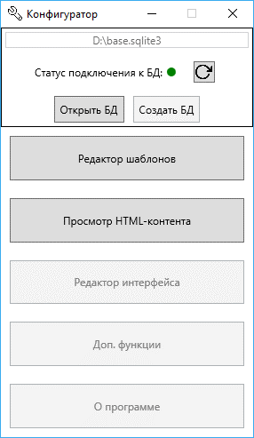

# Конфигуратор для [помощника старшего специалиста](https://github.com/V0v1kkk/EmailTemplatesAdd-InForOutlook)

Создание нового шаблона и кнопки в клиентском приложении, к которой он привязан, можно разделить на:
* Создание эталонного письма в Microsoft Outlook, сохранение его как html
* Импорт нового html-шаблона в базу данных
* Создание нового шаблона письма
* Добавление кнопки в пользовательский интерфейс

 ---

### Импорт нового html-шаблона в базу данных

* При импорте шаблона автоматически удаляются все лишние ссылки
* С помощью элементов управления внизу формы можно удалять абзацы из письма не прикасаясь к html-разметке

 ---

### Просмотр имеющихся в БД html-шаблонов

* При просмотре html-шаблонов есть возможность включить вычисление значения макросов в шаблонах
* Если при включённой обработке макросов открыть какой-либо html-шаблон для редактирования, в нём замена макросов так же будет включена

 ---

 ### Создание нового шаблона письма

* E-mail адреса добавляются через ;
* Доступен пред просмотр выбранного html-шаблона
* Доступна установка напоминаний для получателей и высокой важности

 ---

 Предстоит сделать:
 - [ ] Древовидный редактор интерфейса  
 - [ ] Подключить логирование
 - [ ] Добавить информацию о программе
 - [ ] Замена адресата в групее шалонов
 - [ ] Добавление адресата в группу шаблонов
 - [ ] Удаление адресата из группы шаблонов
 - [ ] Диспетчер баз данных